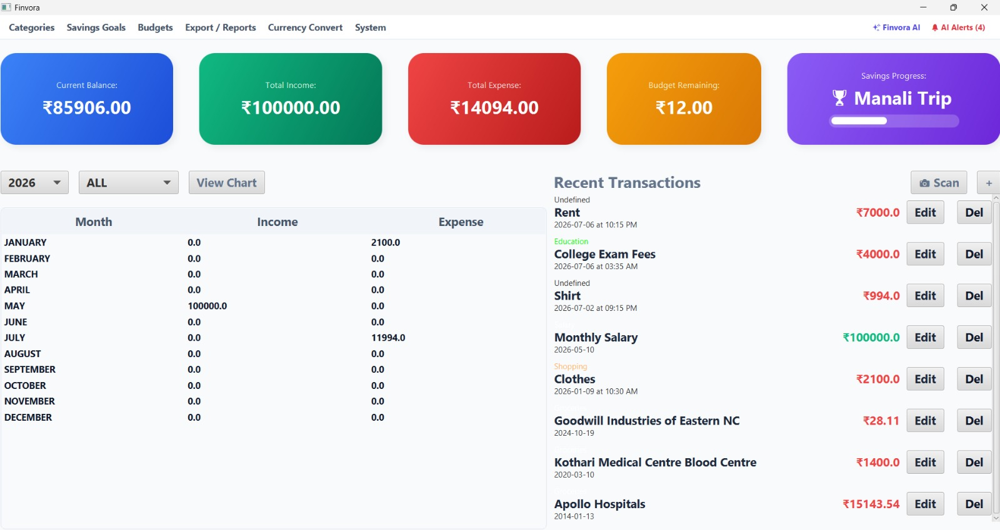
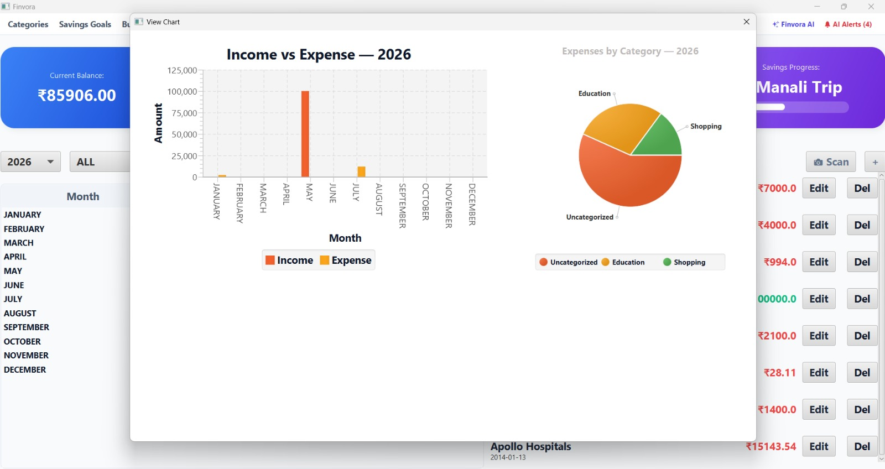
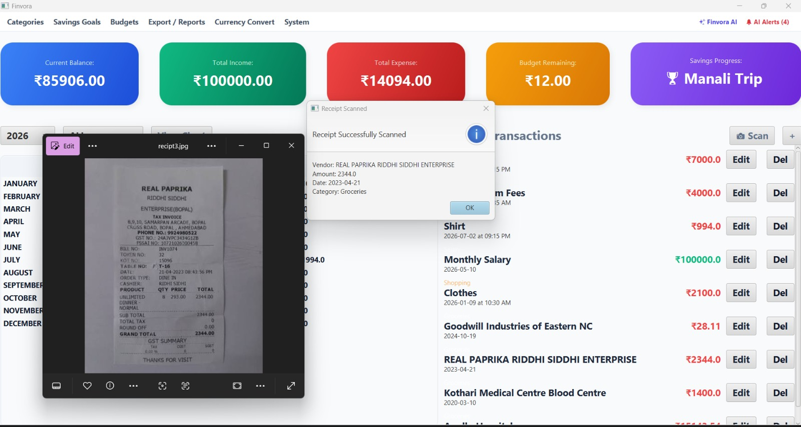
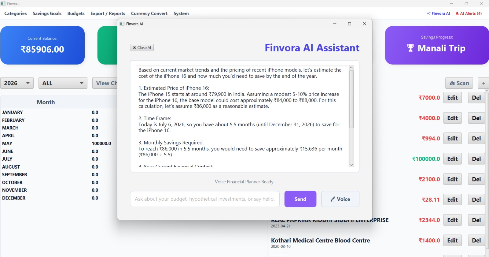
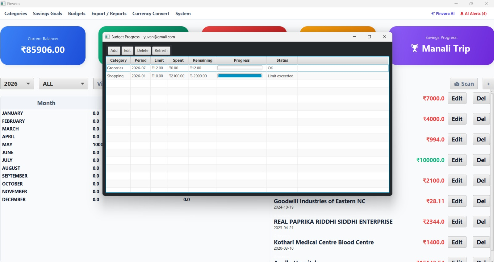
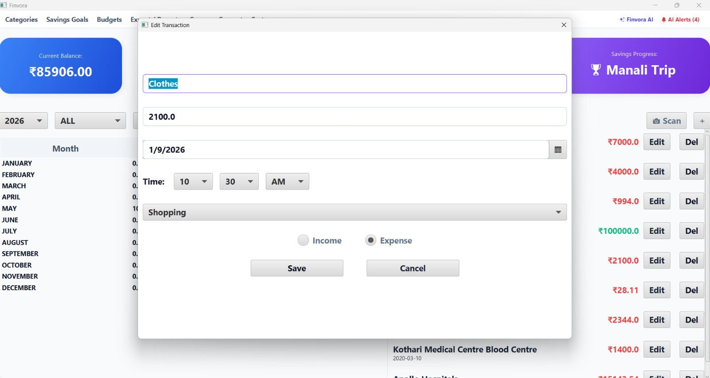
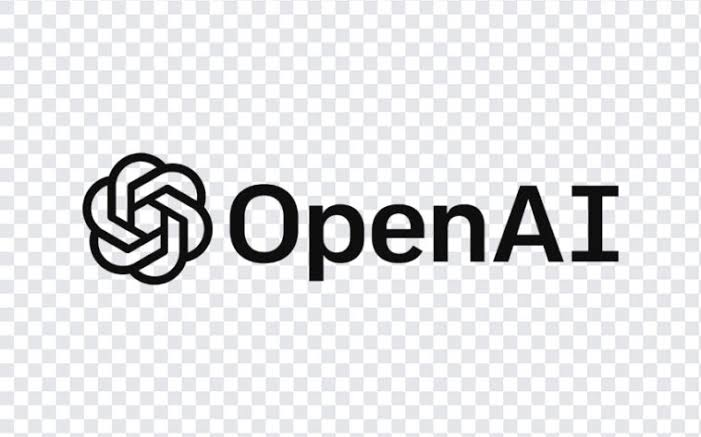
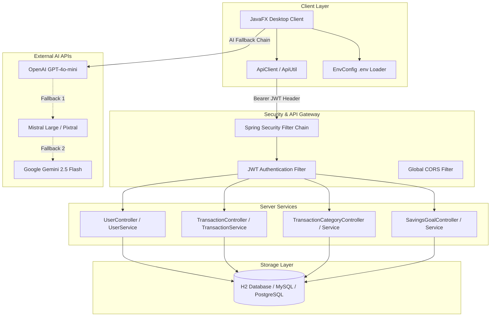

<div align="center">
  
</div>

<br />

<p align="center">

<a href="LICENSE">
  
</a>

<a href="https://github.com/yuvanvishnupandi/Finance_Tracker_APP/stargazers">
  
</a>

<a href="https://github.com/yuvanvishnupandi/Finance_Tracker_APP/network/members">
  
</a>

<a href="https://github.com/yuvanvishnupandi/Finance_Tracker_APP/commits/main">
  
</a>

</p>

<p align="center">

<a href="https://www.oracle.com/java/">
  
</a>

<a href="https://spring.io/projects/spring-boot">
  
</a>

<a href="https://openjfx.io/">
  
</a>

<a href="https://deepmind.google/technologies/gemini/">
  
</a>

<a href="https://mistral.ai/">
  
</a>

<a href="https://openai.com/">
  
</a>

</p>

---

<div align="center">

<table>
  <tr>
    <td></td>
    <td></td>
  </tr>
  <tr>
    <td></td>
    <td></td>
  </tr>
  <tr>
    <td></td>
     <td></td>
  </tr>
 
</table>

</div>

---
## What you get
<div align="center">


</div>
<details>
<summary><b>See all features</b></summary>

<table>
<tr>
<td width="50%" valign="top">

#### 💰 Core financial tracking

- **Expense Tracking** — monitor total expenses, view spending trends, and receive automated insights.
- **Budget Management** — track overall budget utilization and monitor category-specific limits.
- **Savings Goals** — track progress bars and percentage gauges for specific financial targets.
- **Transaction History** — chronological logs of transactions with precise dates and times.
- **Data Export** — single-click exporting of financial data into PDF and CSV format.
- **Currency Converter** — instantly convert between different currencies.
- **Robust Security** — BCrypt password hashing, stateless JWT authentication, and strict user data isolation.

</td>
<td width="50%" valign="top">

#### 🧠 AI features

- **Dedicated AI Assistant** — a conversational AI window that knows your exact balance, transactions, and goals.
- **Voice-Activated Chat** — inline voice prompting with infinite Google TTS chunking.
- **AI Receipt Scanner** — upload receipts to automatically extract names, amounts, and dates with zero manual entry.
- **Multi-LLM Engine** — resilient routing powered by OpenAI, Mistral, and Gemini with automatic timeout & fallback.
- **Predictive AI Alerts** — real-time anomaly detection and proactive budget threshold warnings.

</td>
</tr>
</table>

</details>

<br />

## 🚀 Tech Stack

<table align="center">
<tr>

<td align="center" width="180" height="180">
<a href="https://www.oracle.com/java/">
<br><br>
<b>Java (17+)</b>
</a>
</td>

<td align="center" width="180" height="180">
<a href="https://spring.io/projects/spring-boot">
<br><br>
<b>Spring Boot 3</b>
</a>
</td>

<td align="center" width="180" height="180">
<a href="https://openjfx.io/">
   
  <b>JavaFX 23</b>
</a>
</td>

<td align="center" width="180" height="180">
<a href="https://maven.apache.org/">
<br><br>
<b>Maven 3.9+</b>
</a>
</td>

</tr>

<tr>

<td align="center" width="180" height="180">
<a href="https://www.h2database.com/">
<br><br>
<b>H2 Database</b>
</a>
</td>

<td align="center" width="180" height="180">
<a href="https://deepmind.google/technologies/gemini/">
<br><br>
<b>Gemini 2.5 Flash</b>
</a>
</td>

<td align="center" width="180" height="180">
<a href="https://openai.com/">
<br><br>
  <b>OpenAI GPT-4o-mini</b>
</a>
</td>

<td align="center" width="180" height="180">
<a href="https://mistral.ai/">
<br><br>
<b>Mistral Large / Pixtral</b>
</a>
</td>

</tr>
</table>

<br>

<h2 id="architecture">🏛️ Overall System Architecture</h2>

The application follows a decoupled client-server architecture, allowing rapid local processing backed by cloud AI inference.



<br />

<h2 id="local-setup">🚀 Local Setup & Getting Started</h2>

### Prerequisites

- **Java Development Kit (JDK)**: JDK 17, JDK 21, or JDK 26.
- **Apache Maven**: Version 3.9+ installed and on system PATH.

### 1. Clone Repository

```bash
git clone https://github.com/yuvanvishnupandi/Finance_Tracker_APP.git
cd Finance_Tracker_APP
```

### 2. Configure Environment Variables

Create a `.env` file in the root directory (or set system environment variables):

```env
# Server Security
JWT_SECRET=your-secure-256-bit-secret-key-here-minimum-32-characters
JWT_EXPIRATION_MS=86400000

# Client AI Provider Keys (Optional: configure at least one for AI features)
OPENAI_API_KEY=your_openai_api_key_here
MISTRAL_API_KEY=your_mistral_api_key_here
GEMINI_API_KEY=your_gemini_api_key_here

# Client Backend Endpoint
FINVORA_API_URL=http://localhost:8080
```

### 3. Start Spring Boot Server

```bash
cd expense-tracker-springboot-server
mvn spring-boot:run
```

- Server starts on `http://localhost:8080`
- Interactive OpenAPI / Swagger UI: `http://localhost:8080/swagger-ui.html`
- OpenAPI JSON documentation: `http://localhost:8080/v3/api-docs`

### 4. Start JavaFX Frontend Client

In a separate terminal:

```bash
cd expense-tracker-client
mvn compile javafx:run
```

<br />

## 🧪 Testing

Run the automated test suites for both modules:

```bash
# Run server unit and integration tests (54 tests)
mvn test -f expense-tracker-springboot-server/pom.xml

# Run client tests
mvn test -f expense-tracker-client/pom.xml
```

<br />

<h2 id="environment-variables">Configuration Reference</h2>

<details>
<summary><b>Server Profiles & Properties</b></summary>

| Property | Default | Description |
|----------|---------|-------------|
| `spring.profiles.active` | `dev` | Active environment profile (`dev`, `prod`) |
| `server.port` | `8080` | Backend HTTP API port |
| `app.jwt.secret` | (32+ char HMAC key) | Secret for signing HMAC-SHA256 JWT tokens |
| `app.jwt.expiration-ms` | `86400000` | Token expiration in milliseconds (24h) |
| `spring.datasource.url` | `jdbc:h2:file:./data/expense_tracker_db` | H2 database URL |

</details>

<br />

## 🔒 Security Highlights

- **Password Hashing**: BCrypt encryption on signup with configurable strength.
- **Stateless Authentication**: JJWT token issuance with signature verification.
- **Data Isolation**: Endpoints verify that the authenticated user owns the requested transactions, categories, and goals before reading or modifying data.
- **CORS & CSRF**: Secure CORS configuration bean supporting configurable origins with CSRF disabled for stateless REST.

<br />

## License

Finvora is [MIT licensed](LICENSE).
