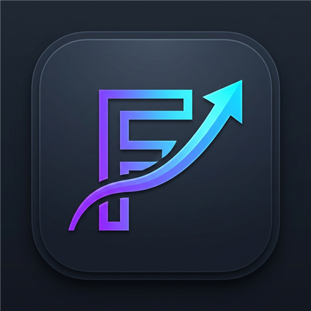
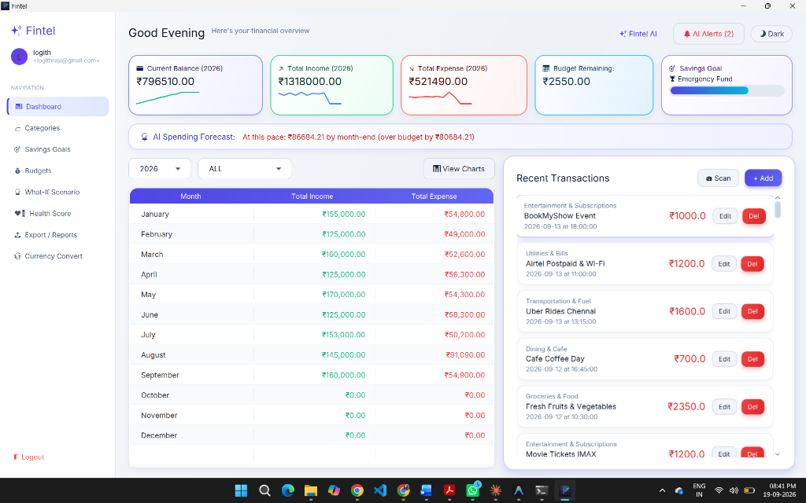
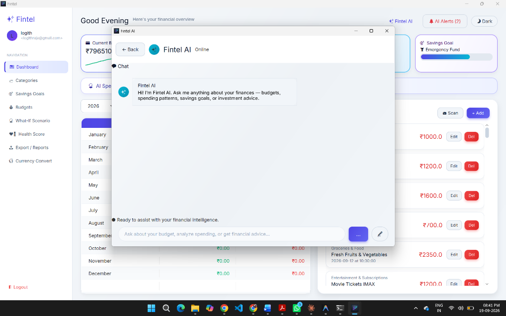
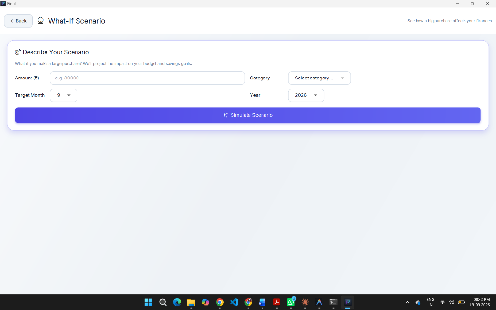
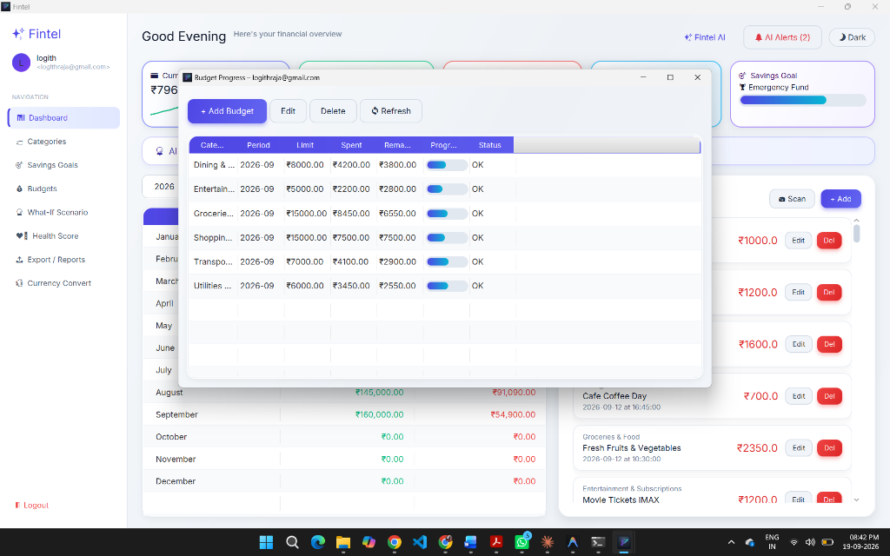
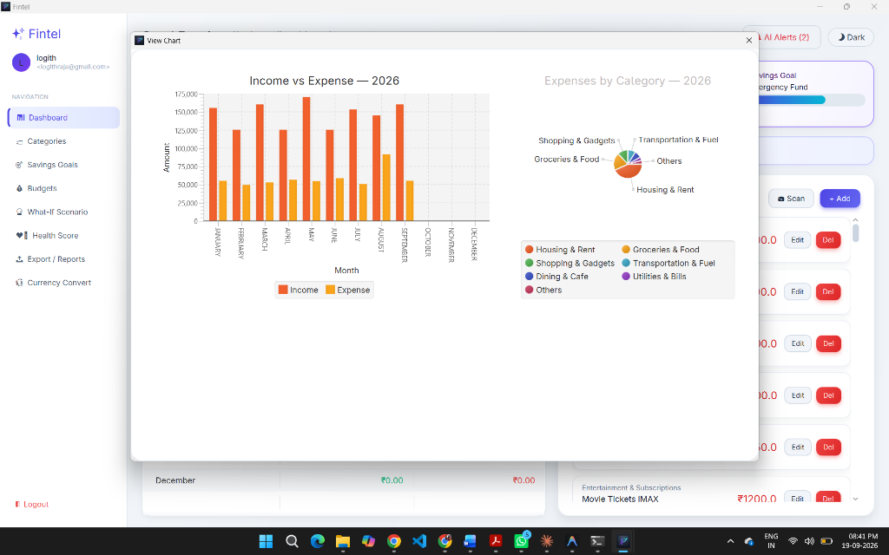
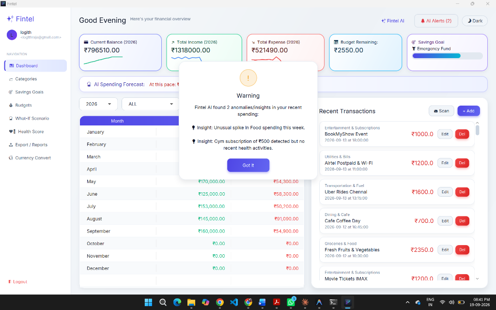
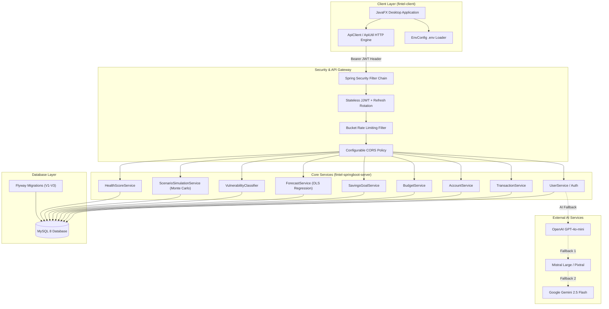

<div align="center">
  
  <h1 align="center" style="font-size: 2.8rem; font-weight: 800; margin-top: 14px; margin-bottom: 6px; letter-spacing: 1px;">FINTEL</h1>
  <p align="center" style="font-size: 1.15rem; color: #64748B; margin-top: 0; font-weight: 500;">Personal Finance Management &amp; Autonomous AI Intelligence Suite</p>
</div>

<br />

<p align="center">

<a href="LICENSE">
  
</a>

<a href="https://github.com/logithraja/JAVA_PBL_FINTEL/stargazers">
  
</a>

<a href="https://github.com/logithraja/JAVA_PBL_FINTEL/network/members">
  
</a>

<a href="https://github.com/logithraja/JAVA_PBL_FINTEL/commits/main">
  
</a>

</p>

<p align="center">

<a href="https://www.oracle.com/java/">
  
</a>

<a href="https://spring.io/projects/spring-boot">
  
</a>

<a href="https://openjfx.io/">
  
</a>

<a href="https://www.mysql.com/">
  
</a>

<a href="https://deepmind.google/technologies/gemini/">
  
</a>

<a href="https://mistral.ai/">
  
</a>

<a href="https://openai.com/">
  
</a>

</p>

---

## 📸 Application Showcase

<div align="center">

<table>
  <tr>
    <td align="center"><b>Modern Executive Dashboard</b></td>
    <td align="center"><b>Fintel Conversational AI</b></td>
  </tr>
  <tr>
    <td></td>
    <td></td>
  </tr>
  <tr>
    <td align="center"><b>Future You — What-If Engine</b></td>
    <td align="center"><b>Automated Budget Allocation</b></td>
  </tr>
  <tr>
    <td></td>
    <td></td>
  </tr>
  <tr>
    <td align="center"><b>Interactive Analytics & Charts</b></td>
    <td align="center"><b>Proactive AI Anomalies & Alerts</b></td>
  </tr>
  <tr>
    <td></td>
    <td></td>
  </tr>
</table>

</div>

---

## ✨ Features at a Glance

<details open>
<summary><b>Explore Core & Advanced Capabilities</b></summary>

<table>
<tr>
<td width="50%" valign="top">

#### 💰 Core Financial Tracking

- **Expense Tracking** — Monitor cash flow, categorised transactions, and real-time ledger updates.
- **Budget Management** — Set monthly spending thresholds per category with rollover rules and progress visualization.
- **Savings Goals** — Define multi-month targets with dynamic pacing gauges.
- **Multi-Account Support** — Checking, savings, credit cards, and cash wallets with dedicated balances.
- **Data Export** — 1-click export to itemized CSV and professional PDF reports.
- **Currency Converter** — Real-time cross-currency conversions.
- **Enterprise Security** — BCrypt password hashing, stateless JJWT auth with refresh token rotation, and strict tenant isolation.

</td>
<td width="50%" valign="top">

#### 🧠 Intelligent AI Engine

- **Conversational Financial Copilot** — Context-aware AI assistant equipped with user balances, transactions, and goals.
- **Multi-LLM Fallback Architecture** — Resilient cascade across OpenAI GPT-4o-mini, Mistral Large, and Google Gemini 2.5 Flash with automatic failover.
- **AI Vision Receipt Scanner** — Upload paper receipts or digital PDFs to auto-extract vendor, amount, date, and category.
- **Proactive Anomaly Alerts** — Background heuristic & LLM surveillance identifying overspending risk before month-end.

</td>
</tr>
</table>

<table>
<tr>
<td width="50%" valign="top">

#### 🔮 Future You — Scenario Engine

- **What-If Simulation** — Simulate capital purchases and evaluate impact across 12-month projections.
- **Baseline Forecasting** — Ordinary Least Squares (OLS) linear regression on historical spending patterns.
- **Monte Carlo Simulation** — 1,000-iteration stochastic projection with confidence intervals.
- **Vulnerability Classification** — Coefficient of variation and trend-based risk clustering.
- **Goal Impact Modeling** — Real-time recalculation of target goal deadlines based on proposed scenarios.

</td>
<td width="50%" valign="top">

#### ❤️ Financial Health Score

- **Composite Scoring (0-100)** with letter grading (A+ through F) and animated SVG gauge.
- **Savings Rate** — Income vs. expenditure efficiency ratio.
- **Spending Consistency** — Variance stability tracking across consecutive quarters.
- **Goal Adherence** — Milestones progress velocity.
- **Tailored Action Items** — Automated rule-based advice targeting weak metrics.

</td>
</tr>
</table>

</details>

<br />

## 🚀 Tech Stack

<table align="center">
<tr>

<td align="center" width="180" height="180">
<a href="https://www.oracle.com/java/">
<br><br>
<b>Java 17 / 21+</b>
</a>
</td>

<td align="center" width="180" height="180">
<a href="https://spring.io/projects/spring-boot">
<br><br>
<b>Spring Boot 3.2</b>
</a>
</td>

<td align="center" width="180" height="180">
<a href="https://openjfx.io/">
<br><br>
<b>JavaFX 23</b>
</a>
</td>

<td align="center" width="180" height="180">
<a href="https://maven.apache.org/">
<br><br>
<b>Maven 3.9+</b>
</a>
</td>

</tr>

<tr>

<td align="center" width="180" height="180">
<a href="https://www.mysql.com/">
<br><br>
<b>MySQL 8</b>
</a>
</td>

<td align="center" width="180" height="180">
<a href="https://flywaydb.org/">
<br><br>
<b>Flyway Migrations</b>
</a>
</td>

<td align="center" width="180" height="180">
<a href="https://www.docker.com/">
<br><br>
<b>Docker & Compose</b>
</a>
</td>

<td align="center" width="180" height="180">
<a href="https://commons.apache.org/proper/commons-math/">
<br><br>
<b>Apache Commons Math</b>
</a>
</td>

</tr>
</table>

<br>

<h2 id="architecture">🏛️ System Architecture</h2>

Fintel is architected as an enterprise-grade decoupled system with a JavaFX client, Spring Boot REST server, Flyway schema migrations, and secure AI proxying:



<br />

<h2 id="local-setup">🚀 Quick Start & Setup</h2>

### Prerequisites

- **JDK 17 or higher** (JDK 17, 21, or 26 supported)
- **Apache Maven 3.9+**
- **MySQL 8.0+** (or Docker)

---

### 1. Clone Repository

```bash
git clone https://github.com/logithraja/JAVA_PBL_FINTEL.git
cd JAVA_PBL_FINTEL
```

### 2. Configure Environment

Copy `.env.example` to `.env` and fill in your database credentials and optional AI API keys:

```bash
cp .env.example .env
```

```env
# Database Settings
DB_HOST=localhost
DB_PORT=3306
DB_NAME=fintel_db
DB_USER=root
DB_PASSWORD=your_mysql_password_here

# JWT Security
JWT_SECRET=fintelSuperSecretKeyThatIsAtLeast32BytesLongForSecurity!

# Multi-LLM API Keys (Optional)
OPENAI_API_KEY=
MISTRAL_API_KEY=
GEMINI_API_KEY=
```

### 3. Create Database

Log in to MySQL and create the database:

```sql
CREATE DATABASE fintel_db;
```

*(Flyway automatically applies all schema migrations `V1__init_schema.sql`, `V2__phase3_features.sql`, and `V3__fix_budget_period_type.sql` on startup).*

---

### 4. Run the Application

#### Option A: One-Click Startup Script (Windows)

Launch both the Spring Boot backend and JavaFX desktop client simultaneously:

```powershell
.\run-all.ps1
```
*Or double-click `run-all.bat`.*

#### Option B: Manual Startup

**Terminal 1 — Spring Boot Server:**
```bash
cd fintel-springboot-server
mvn spring-boot:run
```
- API Base: `http://localhost:8080`
- Swagger UI Documentation: `http://localhost:8080/swagger-ui.html`
- OpenAPI JSON Spec: `http://localhost:8080/v3/api-docs`
- Actuator Health Check: `http://localhost:8080/actuator/health`

**Terminal 2 — JavaFX Client:**
```bash
cd fintel-client
mvn compile javafx:run
```

#### Option C: Docker Compose (Backend + MySQL)

```bash
docker-compose up --build -d
```

---

## 🧪 Automated Testing

Fintel includes 124+ automated tests covering security, controllers, services, algorithms, and integration:

```bash
# Run Backend Test Suite (118 tests: OLS regression, Monte Carlo, JWT, migrations, controllers)
mvn test -f fintel-springboot-server/pom.xml

# Run Frontend Client Tests (6 tests: API utility, budget store, environment config)
mvn test -f fintel-client/pom.xml
```

Tests execute against an isolated in-memory H2 database with zero external dependencies required.

---

## 📦 Client Fat-JAR & Native Bundling

To package the standalone client executable:

```powershell
.\package-client.ps1
```

This compiles a shaded, self-contained executable JAR at `fintel-client/target/fintel-client-1.0-SNAPSHOT.jar`, and invokes JDK `jpackage` (if available) to generate a native Windows application image.

---

## 📁 Repository Structure

```
JAVA_PBL_FINTEL/
├── .github/workflows/          # GitHub Actions CI matrix (Ubuntu, Windows, JDK 17 & 21)
├── assets/                     # Application screenshots, logos, and UI assets
├── docs/                       # Project documentation & Academic PBL Report
│   └── Fintel_PBL_Report.docx  # Final PBL Project Report
├── scripts/                    # Database seeding and utility scripts
│   └── seed_demo_transactions.sql
├── fintel-springboot-server/   # Spring Boot REST API Backend
│   ├── src/main/java/          # Controllers, entities, repositories, security, services
│   ├── src/main/resources/     # Application properties, Flyway migrations, Logback
│   ├── src/test/java/          # Comprehensive JUnit 5 test suite
│   ├── Dockerfile              # Multi-stage production container build
│   └── pom.xml
├── fintel-client/              # JavaFX Desktop Frontend Client
│   ├── src/main/java/          # Views, controllers, models, utils, AI monitor
│   ├── src/main/resources/     # Stylesheets, icons, views
│   ├── src/test/java/          # Client unit tests
│   └── pom.xml
├── .env.example                # Sample environment template
├── .gitignore                  # Production-grade git ignore patterns
├── docker-compose.yml          # Container orchestration (Server + MySQL 8)
├── LICENSE                     # MIT License
├── package-client.ps1          # Standalone client bundler
├── run-all.ps1 / run-all.bat   # Simultaneous launcher scripts
├── run-server.ps1 / .bat       # Backend launcher
├── run-client.ps1 / .bat       # Frontend launcher
└── README.md                   # Project documentation
```

---

## 🔒 Security & Quality Assurance

- **Zero Plaintext Secrets**: All tokens, keys, and connection strings are managed via `.env` and environment variables.
- **Refresh Token Rotation**: Automatic revocation upon reuse detection prevents replay attacks.
- **Data Isolation**: Strict user-level authorization verification across all REST endpoints.
- **Resilient AI Ingestion**: Guarded by in-flight request locking, local disk caching, and multi-provider failover.

---

## 📄 License

This project is licensed under the [MIT License](LICENSE).
